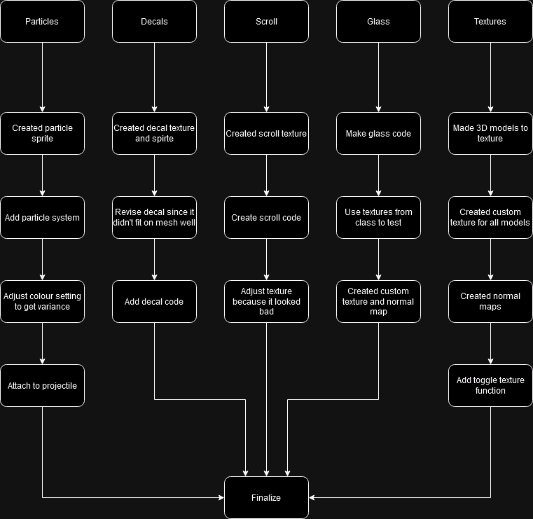

Part One:

Normal map - brick line texture with added grain, blur, crystalize filter and then normal map filter in photoshop.

LUTs - made in photoshop with gradient maps and other filters. Warm and cool were required. Weird LUT was a fun experiment that could be used when the player has a debuff on them. Sunset LUT could we used at sunset to set the atmosphere.

Rim light - Used on the Bunny monster to help it standout and give it a nice effect 

Holoshader - Used on the heart to make it look like an interactable item 

Toon shader - no real use in scene for now want to use it on the models eventually. Want to do a custom ramp to help define where colours go.

Specular - Unsure of final use in game. Could maybe be use for certain items

Diffuse - Same as above maybe for building or walls

Ambient - Could be used for some of our environment models

Part Two:

Particles: Implimented by using the particle system in unity and adjusting the values to get ideal effects. Colour varrince was added using this system

Decal: Implimented using the code learned from class and the core systems of our game.

Glass: Implimented using the code learned from class and with custom texture and normal map

Scrolling: Implimented using the code learned from class and with custom texture

Textures: Made based on our custom models 

